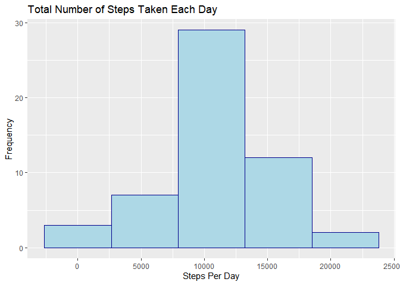
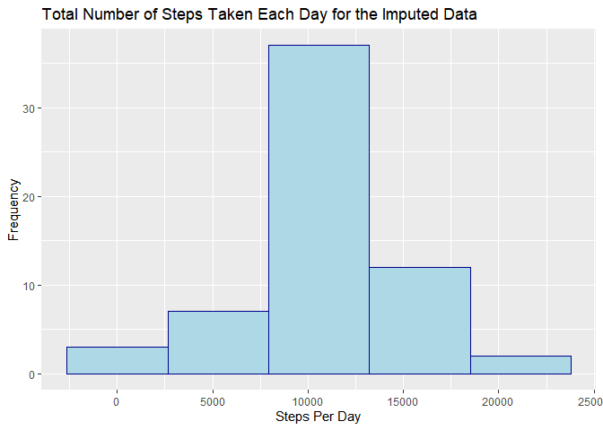
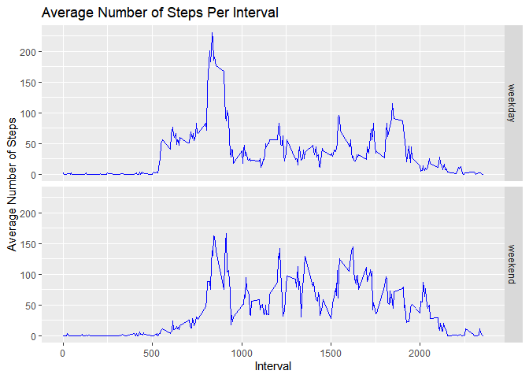

## Loading required packages

```r
library(data.table)
library(dplyr)
library(ggplot2)
```

## Loading and preprocessing the data

```r
act <- as_tibble(fread("activity.csv",na.strings = "NA"))
act
```

```
## # A tibble: 17,568 x 3
##    steps date       interval
##    <int> <chr>         <int>
##  1    NA 2012-10-01        0
##  2    NA 2012-10-01        5
##  3    NA 2012-10-01       10
##  4    NA 2012-10-01       15
##  5    NA 2012-10-01       20
##  6    NA 2012-10-01       25
##  7    NA 2012-10-01       30
##  8    NA 2012-10-01       35
##  9    NA 2012-10-01       40
## 10    NA 2012-10-01       45
## # ... with 17,558 more rows
```


## What is mean total number of steps taken per day?
1. Calculating the total number of steps taken per day - 

```r
good <- complete.cases(act$steps)
actmean <- act[good,c(1,2)]
actmean <- actmean %>%
        mutate(date = as.Date(date,"%Y-%m-%d")) %>%
        group_by(date) %>%
        summarise(totalsteps = sum(steps))
```
2. Making a histogram of the total number of steps taken each day - 

```r
        ggplot(data = actmean,aes(x=totalsteps)) +
                geom_histogram(color = "darkblue",fill = "lightblue",bins = 5) +
                xlab("Steps Per Day") +
                ggtitle("Total Number of Steps Taken Each Day") +
                ylab("Frequency")
```

<!-- -->
  
3. Calculating  and reporting the mean and median of the total number of steps taken per day

```r
round(mean(actmean$totalsteps))
```

```
## [1] 10766
```

```r
median(actmean$totalsteps)
```

```
## [1] 10765
```


## What is the average daily activity pattern?
1. Make a time series plot (i.e. type = "l") of the 5-minute interval (x-axis) and the average number of steps taken, averaged across all days (y-axis)


```r
actint <- act[good,c(1,3)]
actint <- actint %>%
        group_by(interval) %>%
        summarise(meanSteps = mean(steps))
ggplot(data = actint, aes(interval,meanSteps)) +
        geom_line() +
        ggtitle("Average Number of Steps Per Interval") +
        xlab("Interval") +
        ylab("Average Number of Steps")
```

<!-- -->
  
2. Which 5-minute interval, on average across all the days in the dataset, contains the maximum number of steps?

```r
maxint <- actint$interval[which.max(actint$meanSteps)]
maxint
```

```
## [1] 835
```

```r
maxsteps <- round(actint$meanSteps[actint$interval==835],1)
maxsteps
```

```
## [1] 206.2
```
**The interval with maximum number of steps is 835, the number of steps in that interval is 206.2.**


## Imputing missing values
Note that there are a number of days/intervals where there are missing values (coded as NA). The presence of missing days may introduce bias into some calculations or summaries of the data.

1. Calculating and reporting the total number of missing values in the dataset (i.e. the total number of rows with NAs)

```r
sum(is.na(act))
```

```
## [1] 2304
```
  
2. Devise a strategy for filling in all of the missing values in the dataset. The strategy does not need to be sophisticated. For example, you could use the mean/median for that day, or the mean for that 5-minute interval, etc.

We have already calculated the mean number of steps for each interval previously. Using that data we can impute the missing values by filling the NAs with the mean number of steps for that particular interval. The process of imputing the NA values is described next.
  
3. Create a new dataset that is equal to the original dataset but with the missing data filled in.  

```r
act1 <- act
for(i in 1:nrow(act1)){
        if(is.na(act1$steps[i])){
                value <- actint$meanSteps[which(actint$interval==act1$interval[i])]
                act1$steps[i] <- value
        }
}
```
  
4. Make a histogram of the total number of steps taken each day and Calculate and report the mean and median total number of steps taken per day. Do these values differ from the estimates from the first part of the assignment? What is the impact of imputing missing data on the estimates of the total daily number of steps?


```r
good <- complete.cases(act1$steps)
actmean1 <- act1[good,c(1,2)]
actmean1 <- actmean1 %>%
        mutate(date = as.Date(date,"%Y-%m-%d")) %>%
        group_by(date) %>%
        summarise(totalsteps = sum(steps))

        ggplot(data = actmean1,aes(x=totalsteps)) +
                geom_histogram(color = "darkblue",fill = "lightblue",bins = 5) +
                xlab("Steps Per Day") +
                ggtitle("Total Number of Steps Taken Each Day for the Imputed Data") +
                ylab("Frequency")
```

<!-- -->

```r
mean(actmean1$totalsteps)
```

```
## [1] 10766.19
```

```r
median(actmean1$totalsteps)
```

```
## [1] 10766.19
```
**The mean and median remain the same, only a slight difference in the value of the median. This happens because of our imputing strategy where we have used the mean values of the intervals to fill in for the missing values, therefore mean remains the sames and the median differs by a small value.**  

## Are there differences in activity patterns between weekdays and weekends?

1. Create a new factor variable in the dataset with two levels – “weekday” and “weekend” indicating whether a given date is a weekday or weekend day.


```r
act1 <- mutate(act1,date = as.Date(date,"%Y-%m-%d"))

factorday <- function(date_val){
        if(weekdays(date_val)=="Sunday"||weekdays(date_val)=="Saturday"){
                x <- "weekend"
        }else{
                x <- "weekday"
        }
        x
}
act1$daytype <- as.factor(sapply(act1$date,factorday))
```
  
2. Make a panel plot containing a time series plot (i.e. type = "l") of the 5-minute interval (x-axis) and the average number of steps taken, averaged across all weekday days or weekend days (y-axis). See the README file in the GitHub repository to see an example of what this plot should look like using simulated data.  

```r
act1 <- act1 %>%
        group_by(interval,daytype) %>%
        summarise(meanSteps = mean(steps))
ggplot(data = act1, aes(interval,meanSteps)) +
        geom_line(color = "blue") +
        facet_grid(daytype~.) +
        ggtitle("Average Number of Steps Per Interval") +
        xlab("Interval") +
        ylab("Average Number of Steps")
```

<!-- -->


